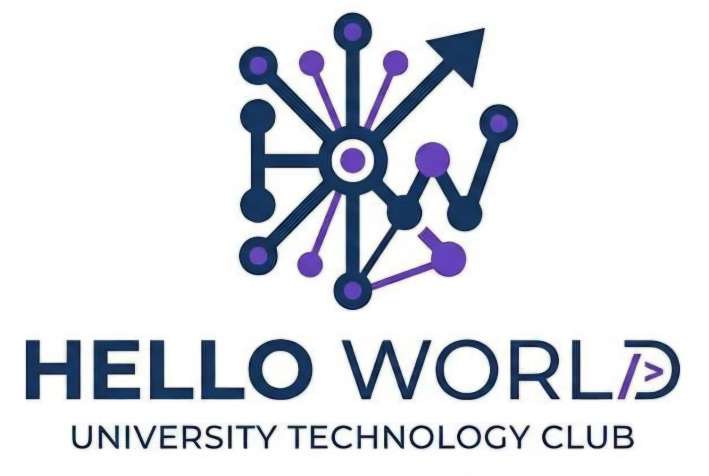

# 🌐 Hello World - Club de Programación Competitiva

<div align="center">



**Club oficial de programación competitiva y desarrollo de software de la FES Aragón, UNAM**

[](https://www.djangoproject.com/)
[](https://www.python.org/)
[](https://developer.mozilla.org/es/docs/Web/HTML)
[](https://developer.mozilla.org/es/docs/Web/CSS)
[](https://developer.mozilla.org/es/docs/Web/JavaScript)

</div>

---

## Descripción

Plataforma web del Club Hello World de la Facultad de Estudios Superiores Aragón. Este proyecto tiene como objetivo formar equipos de alto rendimiento para hackatones y desafíos de programación, promoviendo la innovación tecnológica y el desarrollo de habilidades técnicas y blandas entre los estudiantes.

### Características principales

- 🎨 **Diseño moderno y responsive** - Interfaz adaptable a cualquier dispositivo
- 🌓 **Tema claro/oscuro** - Modo de visualización personalizable
- 📱 **Menú hamburguesa** - Navegación optimizada para móviles
- 🎠 **Carrusel de avisos** - Anuncios dinámicos de eventos y convocatorias
- 👥 **Sección de equipo** - Presentación de la mesa directiva
- 📝 **Formulario de registro** - Sistema de inscripción para nuevos miembros
- 🧱 **Muro de experiencias** - Espacio estilo Padlet para compartir publicaciones con imágenes

---

## 👥 Integrantes

### Equipo de Desarrollo

- **Esteban Alejandro Cedeño Almendra**
- **Valentina Ayelen Cruz Mendoza**
- **Alejandra Naomi Muciño Hernández**
- **Alexander Josué Resendiz Olivera**

---

## 🛠️ Tecnologías Utilizadas

### Backend
- **Django 6.0.3** - Framework web de Python
- **Python 3.x** - Lenguaje de programación principal
- **SQLite** - Base de datos para desarrollo

### Frontend
- **HTML5** - Estructura del contenido
- **CSS3** - Diseño y estilos personalizados
- **JavaScript (ES6+)** - Interactividad y funcionalidades dinámicas
- **Google Fonts** - Tipografías Space Grotesk e Inter

### Herramientas de desarrollo
- **Git & GitHub** - Control de versiones
- **VS Code** - Editor de código
- **python-dotenv** - Gestión de variables de entorno
- **certifi** - Certificados SSL para Python

---

## 🚀 Instrucciones de Instalación y Ejecución

### Prerrequisitos

Asegúrate de tener instalado en tu sistema:
- Python 3.8 o superior
- pip (gestor de paquetes de Python)
- Git

### 1️⃣ Clonar el repositorio

```bash
git clone https://github.com/Csealle/HolaMundo.git
cd HolaMundo
```

### 2️⃣ Crear y activar entorno virtual

**En Linux/macOS:**
```bash
python3 -m venv venv
source venv/bin/activate
```

**En Windows:**
```bash
python -m venv venv
venv\Scripts\activate
```

### 3️⃣ Instalar dependencias

```bash
pip install django
pip install python-dotenv
pip install certifi
```

### 4️⃣ Configurar la base de datos

```bash
python manage.py migrate
```

### 5️⃣ Crear superusuario (opcional)

Para acceder al panel de administración de Django:

```bash
python manage.py createsuperuser
```

Sigue las instrucciones en pantalla para configurar usuario y contraseña.

### 6️⃣ Ejecutar el servidor de desarrollo

```bash
python manage.py runserver
```

### 7️⃣ Acceder a la aplicación

Abre tu navegador y visita:
- **Página principal:** http://127.0.0.1:8000/
- **Muro de experiencias:** http://127.0.0.1:8000/muro/
- **Panel de administración:** http://127.0.0.1:8000/admin/

---

## 📁 Estructura del Proyecto

```
HolaMundo/
│
├── core/                   # Configuración principal del proyecto Django
│   ├── settings.py        # Configuraciones del proyecto
│   ├── urls.py            # Rutas URL principales
│   └── wsgi.py            # Configuración WSGI
│
├── miembros/              # Aplicación para gestión de miembros
│   ├── models.py          # Modelos de datos
│   ├── views.py           # Vistas y lógica de negocio
│   ├── forms.py           # Formularios
│   └── admin.py           # Configuración del panel admin
│
├── static/                # Archivos estáticos
│   ├── style.css          # Estilos CSS personalizados
│   └── img/               # Imágenes del proyecto
│
├── templates/             # Plantillas HTML
│   ├── index.html         # Página principal
│   └── muro.html          # Página del muro de experiencias
│
├── db.sqlite3             # Base de datos SQLite
├── manage.py              # Script de gestión de Django
└── README.md              # Este archivo
```

---

## 🎨 Características Visuales

### Paleta de colores

**Modo Claro:**
- Principal: `#1E293B` (Azul oscuro)
- Acento: `#6C4CFF` (Morado tecnológico)
- Fondo: `#ECEFF9` (Azul claro suave)

**Modo Oscuro:**
- Principal: `#F1F5F9` (Texto claro)
- Acento: `#6C4CFF` (Morado tecnológico)
- Fondo: `#0A0F1F` (Azul muy oscuro)

### Tipografía

- **Títulos:** Space Grotesk (500, 600, 700)
- **Texto:** Inter (400, 500, 600)

---

## 📱 Responsive Design

El sitio está completamente optimizado para:
- 📱 Dispositivos móviles (< 768px)
- 💻 Tablets (768px - 1024px)
- 🖥️ Escritorio (> 1024px)

---

## 🤝 Contribuciones

Este proyecto es desarrollado y mantenido por la mesa directiva del Club Hello World. Si eres miembro del club y deseas contribuir:

1. Crea una nueva rama desde `main`
2. Realiza tus cambios
3. Envía un pull request
4. Espera la revisión del equipo

---

## 📧 Contacto

**Email:** helloworld.clubfesa@gmail.com

**Universidad:** Facultad de Estudios Superiores Aragón, UNAM

---

## 📄 Licencia

Este proyecto está bajo la Licencia MIT. Consulta el archivo `LICENSE` para más detalles.

---

<div align="center">

**Desarrollado por el Club Hello World - FES Aragón**

© 2026 Club Hello World - Todos los derechos reservados

</div>
